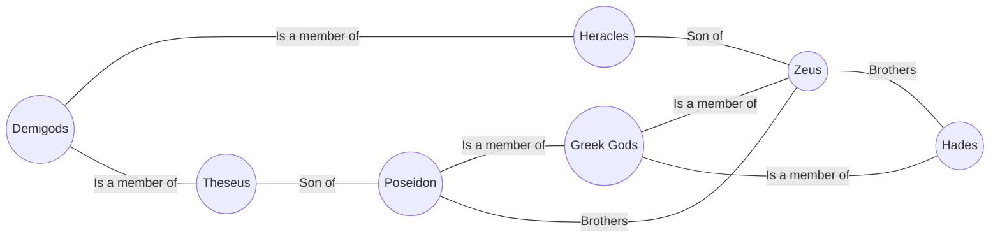

# Design of Atlas

## Overview

Atlas is a project that, in a way similar to Google's Knowledge Graph, will map knowledge "entities" and their
relationships to each other. Assuming we have entities "Zeus", "Poseidon", and "Greek Gods", a query on Zeus
will reveal that he is part of the category "Greek Gods", along with "Poseidon." It will also reveal that 
"Zeus" and "Poseidon" are brothers, and that he gave birth to Heracles, who is a demigod. If we wanted to reveal the relationship betwen Theseus and Heracles, we can see that they're both demigods. And if we wanted to see the relationship between Zeus and Theseus, we can see that Theseus is Zeus' brother's (Poseidon) son (uncle) \
We should be able to print this information in both paragraph form, and graph form. For example, "Zeus is a greek god, and is Theseus' uncle."

## Design Considerations

### Entity Types: 

Entities should have an associating supported type to structure knowledge better.

### Multiple relationships

Entities should be capable of holding multiple relationships.

### Directional, backtrack-able

Relationships should be directional to indicate relationships such as parent-child. For example, "Suzanne Collins wrote The Hunger Games" should
be modeled as `Suzanne Collins --wrote--> The Hunger Games`. If we want to find the writer of the Hunger Games, we should be able to backtrack
the relationship, so we can extend the model further: `The Hunger Games --was written by--> Suzanne Collins`. This means the number of edges is
2x the number of relationships. Consider memory.

### Language Model

The language parser should be able to extract the entities and relationships between entities in text. In the text "Suzanne Collins wrote the Hunger Games", 
the entities are "Suzanne Collins", and "The Hunger Games." The relationship is a "write" relationship. Ideally, the entities will be either the article
subject or a wiki link. In cases where it's a pronoun, the pronoun should be resolved to a concrete entity. If the entity is concrete, but not a wiki link,
we will search for **best match**. 
    
### Best Match

In the case where the entity is concrete, but not a wiki link, find the best matching entity with an acceptable match score. If no entity is found, then
we should either discard, or index anyways. We should only keep entities that have a corresponding wiki article, otherwise we will be indexing random 
data. In the sentence "Tom ate Jim's fish", we would index "Jim's fish". We don't want that. Some indexing concerns.

#### Index all entities beforehand

* Make 2 passes through each article.
* Pass 1: Grab all wiki links and index entities
* Pass 2: Read through text, and index relationships.
* Search in model and find best match. 
* If not found, then discard. 

* **Pros**:
    * All concrete entities have a corresponding article in Wikipedia.
    * No ambiguity in whether two entities are the same. 
    * Only keep defined entities.
    
* **Cons**:
    * Make two passes
    * Would have to store copy of text so that it can be revisited once entities are added (memory inefficient).

#### Greedily index any entity encountered

* Make 1 pass through each article.
* Index wiki links as entities and their corresponding relationships.
* If indefinite entity found, then search in model for best match. If not found, then index indefinite entity.
* Once wiki link found, search the model for best match and mark entity as concrete. 
* At the end, remove all entities that don't have a corresponding wiki article.

* **Pros**:
    * Will be making 1 pass through each article. Clean pipeline. 
    * Can discard text right after using. 
    * Easily parallelizable
* **Cons**:
    * ~~Chance of indexing duplicate entities.~~ No chance of this since we are only indexing entities with wiki articles. 
    * Have to make another pass through model to clean up entities. 
    * Will be storing non-relevant entities temporarily. 
    
### Decision

Go with greedily indexing method. Either way we will have to temporarily store information, and make an extra pass. It's a matter of whether we want to store processed data or raw data. Let's
store processed data. 

### Data Processing + Parsing

Atlas will be using Wikipedia data dumps as its data source. The data will be in the `wikitext` format. So, we need to parse and clean text, retaining only
relevant information such as outgoing links. This text will be the basis for the langugage model. 
Because the data dumps are large, we will extract in chunks, clean and feed those chunks into the language model, then work on extracting and cleaning the 
next chunk. This will work in parallel.

### Output

Output can be in the form of paragraphs or graph model. Should offer both options. Should also offer more information about the queried entities, as well as links and relationships.
Should also user to find other relationships. Overall graph model should be visible as well. 

### Relationship Querying

Relationships are queried for closest path. Also offer other paths. Should also allow querying by entity + relationship to get resulting entity.

## High-Level Design

This project will make a single pass through wikipedia data dumps to create a graph model of all relationships and entities in wikipedia. Once a model is created,
an interpreter will take in user input and query the model to return a response to the user. 

This project will require:
* **Data parser**: To iterate through data dumps, extract articles, expand templates, clean text
* **Language parser**: To take extracted + cleaned articles/text and parse entities and relationships
* **Entity + Relationship indexer**: to index entities and corresponding relationships, handle entity best matches, and cleanup
* **UI**: Takes in user input and queries the indexed model
* **Data persistance**: Flat file or database 

When the program starts for the first time, the data parser will read in downloaded data dumps and using the downloaded index files, will unzip
by chunk and parse the unzipped chunk. The chunk will then be sent to the language parser via a FIFO queue, and the data parser will 
work on the next chunk. The language parser will read in data from the shared FIFO queue, and find entities + relationships. It will 
resolve pronouns by calling a python script. This will probably be the bottleneck. The parsed data will be indexed via observers in the Indexer.

## Data Model

Can either store data in hash graph to support fast lookup in memory, or use a graph database like neo4j that supports shortest path lookup. Persist data after creating the model
so that lookup is quick.

Can't use neo4j embedded with .net, so let's use just a simple file that we'll load into memory. 

## Technology

Must use Python for language parsing. Everything else will be in C#. 
To run interop between python and C#, use named pipes (FIFO) with a Python server and C sharp client. Or could do the other way around, doesn't matter. Named
pipes support bi-directional communication. Let's do C sharp server because it will be accepting data, for semantics.
