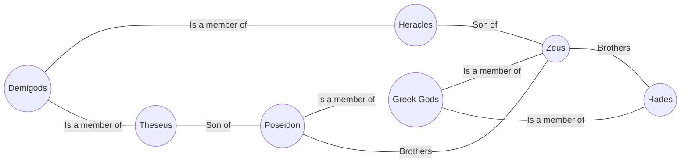

# Design of Atlas

## Overview

Atlas is a project that, in a way similar to Google's Knowledge Graph, will map knowledge "entities" and their
relationships to each other. Assuming we have entities "Zeus", "Poseidon", and "Greek Gods", a query on Zeus
will reveal that he is part of the category "Greek Gods", along with "Poseidon." It will also reveal that 
"Zeus" and "Poseidon" are brothers, and that he gave birth to Heracles, who is a demigod. If we wanted to reveal the relationship betwen Theseus and Heracles, we can see that they're both demigods. And if we wanted to see the relationship between Zeus and Theseus, we can see that Theseus is Zeus' brother's (Poseidon) son. In other words, he is his uncle. \
We should be able to print this information in both paragraph form, and graph form. For example, "Zeus is a greek god, and is Theseus' uncle."



## Design Considerations
* **Many Relationship Types:** \
   We will need to model many different kinds of relationships, 
   and these relationship types may be **mutually exclusive**, depending on the entity type. 
   For example, Poseidon can be classified as a **Person** entity. 
   He may have family relationships, 'has killed' relationships, 'has invented' relationships. 
   But he won't have a 'was written by' relationship, something that might be 
   exclusive to books/music/scores. Relationship types may also be **shared** between entity 
   types. The "is a member of" relationship will most likely be a part of all entity types, 
   though the exact label may change.

   These relationships can be concrete/hard-coded, but they could also consist of only 
   labels/strings to be more flexible.

* **Many Entity Types**: \
   We should be able to recognize different types of entities (Books, People, Music, 
   Movies, Characters, Places). These entities will have different characteristics, and 
   should be treated as separate classifications.

* **Multiple relationships**: \
   We can recognize more than one type of relationship between entity A and entity B. 
   i.e. The relationship between Luke Skywalker and Darth Vader is complex. Darth Vader is 
   not just Luke's father, but also his main antagonist. Luke also killed Darth Vader.

   Relationships may also be directed, or undirected. The 'member' relationship is useful
   as an undirected relationship in case  we'd want to list all members of a category,
   or see whether an entity is part of a category. The 'father-son' relationship should
   be a directed relationship to see who is the father and who is the son. However, if we want
   to find the father from the son, this will be difficult. We could store parent along with
   children edges.

* **Language Model**: \
   We will need to parse through text to identify the relationship between two entities. 
   Given a fragment like "Originally a farmer on Tatooine living with his uncle and aunt", in an
   article about "Luke Skywalker", We should recognize that Luke Skywalker lived on Tatooine.
   Looking at info boxes could make this simpler. 

   Should also recognize when a sentence is not relevant to the article. The sentence 
   "He places him in his X-wing starfighter, which is then flown to Tatooine by R2-D2" is
   irrelevant.

* **Data Processing**: \
   Main data source will be wikipedia's data dumps. These files are very large, so we should
   start with a partition to build a small representation. After testing, expand to 
   other partitions. Could also download, and unzip online, building one sub-component
   at a time, serializing the data we need, and throwing away the rest.

* **Output**: \
   Should be able to output in both paragraph form, and relationship form. Maybe later, 
   I'll expand to include a graph visualized form. 

* **Relationship Querying:** \
   When querying two entities for relationship data, should first find the shortest connection
   possible. If the user wants, find the next shortest connection. So and so forth. When querying
   using an entity and a relationship (who is Luke's mother?), the relationship may have different
   names in the system. Should find either the closest matching one, or say no relationship. 

## Implementation

Atlas will use a multigraph model, with nodes set to knowledge entities, and edges set 
to relationships.

### Entities

Entites are nodes. They should convey name, and type, and definition. Each entity should be able 
to store incoming and outgoing edges.

```csharp
public class Entity {
   EntityType type;
   string name;
   string definition;
   ICollection<Relationship> relations; // storing both incoming and outgoing
}
```

### Relationships

Relationships are edges. They should allow traversal from v1 to v2 and the reverse, v2 to v1. 
Because we need to maintain multiple edges between two nodes, we can have either the entity 
carry the multiple edges, or have a list representing relationships in a single edge class.

```csharp
public class Relationship {
   ICollection<RelationshipType> relations;
   Entity parent;
   Entity child;
}

// or 

public class Entity {
   ICollection<Relationship> relations; // this will be here anyways
   // but in addition to storing unique edges, will also store 
   // same edges.
   // ...
}

public class Relationship {
   Entity parent;
   Entity child;
}
```

The first approach is cleaner in that all relations between v1 and v2 are stored in one place.
It however incurs overhead in that it has to store another collection. The second
approach avoids this overhead, but must implement more complex logic for queries.

### Language Model

#### Relationship Finding

Sentences are complex. This may be most complex part. Atlas must parse sentences to retrieve
a "from" entity, a "to" entity, and their relationship. It must also be able to disregard 
sentences that contain both the "from" and "to" entities, but has an irrelevant relationship.
In the wiki article, "MultiGraph", the sentence "A multigraph is different from a hypergraph."
The two entities are "multigraph" and "hypergraph", but the relationship is "different." 
We might decide not to include this edge at all. 

#### Definition Finding
