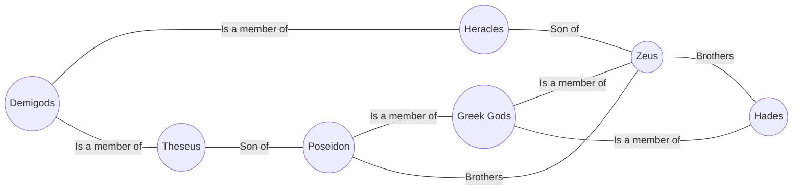

# Design of Atlas

## Overview

Atlas is a project that, in a way similar to Google's Knowledge Graph, will map knowledge "entities" and their
relationships to each other. Assuming we have entities "Zeus", "Poseidon", and "Greek Gods", a query on Zeus
will reveal that he is part of the category "Greek Gods", along with "Poseidon." It will also reveal that 
"Zeus" and "Poseidon" are brothers, and that he gave birth to Heracles, who is a demigod. If we wanted to reveal the relationship betwen Theseus and Heracles, we can see that they're both demigods. And if we wanted to see the relationship between Zeus and Theseus, we can see that Theseus is Zeus' brother's (Poseidon) son (uncle) \
We should be able to print this information in both paragraph form, and graph form. For example, "Zeus is a greek god, and is Theseus' uncle."

## Design Considerations

### Entity Types: 

Entities should have an associating supported type to structure knowledge better.

### Multiple relationships

Entities should be capable of holding multiple relationships.

### Directional, backtrack-able

Relationships should be directional to indicate relationships such as parent-child. For example, "Suzanne Collins wrote The Hunger Games" should
be modeled as `Suzanne Collins --wrote--> The Hunger Games`. If we want to find the writer of the Hunger Games, we should be able to backtrack
the relationship, so we can extend the model further: `The Hunger Games --was written by--> Suzanne Collins`. This means the number of edges is
2x the number of relationships. Consider memory.

### Language Model

The language parser should be able to extract the entities and relationships between entities in text. In the text "Suzanne Collins wrote the Hunger Games", 
the entities are "Suzanne Collins", and "The Hunger Games." The relationship is a "write" relationship. Ideally, the entities will be either the article
subject or a wiki link. In cases where it's a pronoun, the pronoun should be resolved to a concrete entity. If the entity is concrete, but not a wiki link,
we will search for **best match**. 
    
### Best Match

In the case where the entity is concrete, but not a wiki link, find the best matching entity with an acceptable match score. Two ways to approach this:

#### Index all entities beforehand

* Make 2 passes through each article.
* Pass 1: Grab all wiki links and index entities
* Pass 2: Read through text, and index relationships.
* If indefinite entity found, search in model and find best match. 

* **Pros**:

#### Greedily index any entity encountered

* Make 1 pass through each article.
* Index wiki links as entities and their corresponding relationships.
* If indefinite entity found, then search in model for best match. If not found, then index indefinite entity.
* Once wiki link found, search the model for best match and mark entity as concrete. 

### Data Processing + Parsing
Atlas will be using Wikipedia data dumps as its data source. The data will be in the `wikitext` format. So, we need to parse and clean text, retaining only
relevant information such as outgoing links. This text will be the basis for the langugage model. 
Because the data dumps are large, we will extract in chunks, clean and feed those chunks into the language model, then work on extracting and cleaning the 
next chunk. This will work in parallel.

### Output
   

### Relationship Querying

## High-Level Design

This project will make a single pass through wikipedia data dumps to create a graph model of all relationships and entities in wikipedia. Once a model is created,
an interpreter will take in user input and query the model to return a response to the user. 

This project will require:
* **Data parser**: To iterate through data dumps, extract articles, expand templates, clean text
* **Language parser**: To take extracted + cleaned articles/text and parse entities and   
* **Entity + Relationship indexer**: to index entities and corresponding relationships

## Capabilities

## Data Model

## System Design

## 