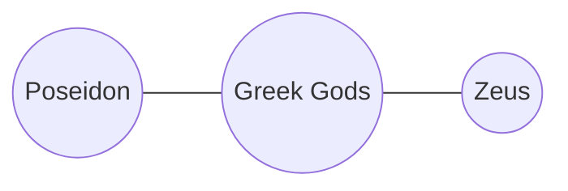

# Design of Atlas

## Overview

Atlas is a project that, in a way similar to Google's Knowledge Graph, will map knowledge "entities" and their
relationships to each other. Assuming we have entities "Zeus", "Poseidon", and "Greek Gods", a query on Zeus
will reveal that he is part of the category "Greek Gods", along with "Poseidon." It will also reveal that 
"Zeus" and "Poseidon" are brothers. 

